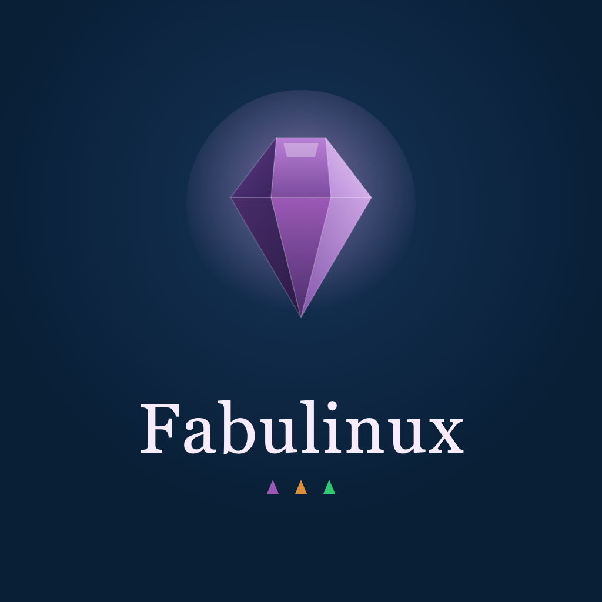

  

<h1 align="center">Fabulinux</h1>

<em>O Linux mais bem lapidado para você que quer criar.</em>

---

## O que é

O **Fabulinux** é uma distribuição Linux **open source** feita para **criativos**. Ela acolhe quem
vem do Mac num universo Linux — **bonita, simples e sem terminal** — funcionando como uma alternativa
acessível ao MacBook, com **identidade própria**.

> Em uma frase: acolher o usuário Mac num universo Linux, mas com alma de gema lapidada.

## Filosofia

- **Curado e opinativo, não configurável.** O sistema chega pronto e coeso. O usuário cria; nós já
  lapidamos as arestas por ele. (A escola do macOS / ChromeOS / elementary OS.)
- **Difícil de quebrar.** O usuário não precisa — e não consegue — desmontar o sistema.
- **Zero terminal.** Tudo se faz por interface gráfica, incluindo instalar aplicativos.

## Para quem

Designers, fotógrafos, videomakers, youtubers, DJs, produtores musicais e escritores.

## Arquitetura

| Camada | Decisão | Por quê |
|---|---|---|
| **Base** | Imutável / atômica, com **rollback** automático | O núcleo é somente-leitura; updates atômicos. Praticamente impossível "não bootar". |
| **Ambiente** | **KDE Plasma 6**, travado em **modo quiosque** (Kiosk) | Widgets nativos, barra de menu global, tudo configurável por GUI — e travável. |
| **Apps** | **Flatpak**, isolados no espaço do usuário | Instalar/bagunçar um app não afeta o sistema. Loja visual, sem terminal. |
| **Assinatura** | Controles de janela em **triângulo, à esquerda** | Gesto familiar do Mac, com a forma da nossa gema. |

> **Referência comprovada:** o **SteamOS** da Valve é exatamente essa arquitetura — base imutável e
> atômica + KDE Plasma travado — rodando em milhões de Steam Decks.

## A experiência "sensação Mac"

1. **Coerência visual absoluta** — um tema, um set de ícones, tipografia consistente.
2. **Dock + busca universal** (estilo Spotlight, ⌘+Espaço).
3. **Gestos de trackpad** — três dedos para as janelas, deslizar entre áreas de trabalho.
4. **Memória muscular do teclado** — a tecla ⌘ mapeada para ⌘+C, ⌘+V, ⌘+Espaço, ⌘+Tab.
5. **"Só funciona"** — impressora, alta resolução, gestão de cor (ICC) e fontes prontas.

## Pacote de apps (curadoria)

Todos gratuitos, open source e instaláveis com um clique. ★ = carro-chefe da categoria.

| Categoria | Apps | Equivalente |
|---|---|---|
| **Dia a dia** | **Geary** ★ (e-mail simples e bonito), Calendário, Calculadora, Widgets, Firefox | Mail, Calendar |
| **Office & escrita** | **OnlyOffice** ★, LibreOffice, Obsidian, Okular | MS Office / WPS |
| **Design gráfico** | **Krita** ★, GIMP, Inkscape, Scribus, Blender | Photoshop, Illustrator, InDesign |
| **Fotografia** | **Darktable** ★, RawTherapee, digiKam | Lightroom |
| **Vídeo & streaming** | **DaVinci Resolve** ★, Kdenlive, OBS Studio, HandBrake | Final Cut / Premiere |
| **Música, DJ & áudio** | **LMMS** ★, Ardour, Mixxx, Audacity | GarageBand, Logic, Serato |
| **Tipografia** | Gerenciador de Fontes + biblioteca curada (Inter, IBM Plex, Lora…) | Font Book |

> _E-mail:_ trocamos o Thunderbird pelo **Geary** — mais simples e acolhedor, alinhado à filosofia.
> Alternativa disponível na loja: Mailspring.

## Identidade visual

Conceito de **pedra preciosa lapidada**: Linux é a pedra bruta; o Fabulinux é o corte que revela o
brilho. O símbolo é uma **gema construída inteiramente de triângulos** — o átomo visual da marca.

- **Paleta:** ametista `#9B59B6` (assinatura) · navy `#081F36` (a caixa de joias) · lavanda `#F3E4F5`
  · reflexo `#C9A0DE` · roxo `#65498C` · verde `#2ECC71` · dourado `#DC8F38`.
- **Tipografia:** serifada elegante nos títulos + sans legível no corpo.
- **Motivo:** o triângulo (faceta) — dos marcadores de lista aos controles de janela.

Materiais visuais neste repositório:
- [`docs/moodboard.html`](docs/moodboard.html) — identidade visual (Fase 1)
- [`docs/roadmap.html`](docs/roadmap.html) — roadmap e pacote de apps

## Roadmap

1. **Conceito, nome & moodboard** ✅ _(concluído)_
2. Protótipo que dá boot (base imutável + KDE travado)
3. A "sensação Mac" (dock, busca, gestos, remap ⌘)
4. Tema coeso & marca (incl. controles de janela em triângulo)
5. O pacote de apps
6. Instalador bonito (Calamares)
7. Teste & primeira ISO

## Status

🟣 **Fase 1 — Identidade visual: concluída.** Nome, conceito, gema, paleta e tipografia definidos.
Próximo: Fase 2 (protótipo).

## Licença

[GPL-3.0](LICENSE). Software livre — no espírito do ecossistema Linux/KDE do qual o Fabulinux nasce.
